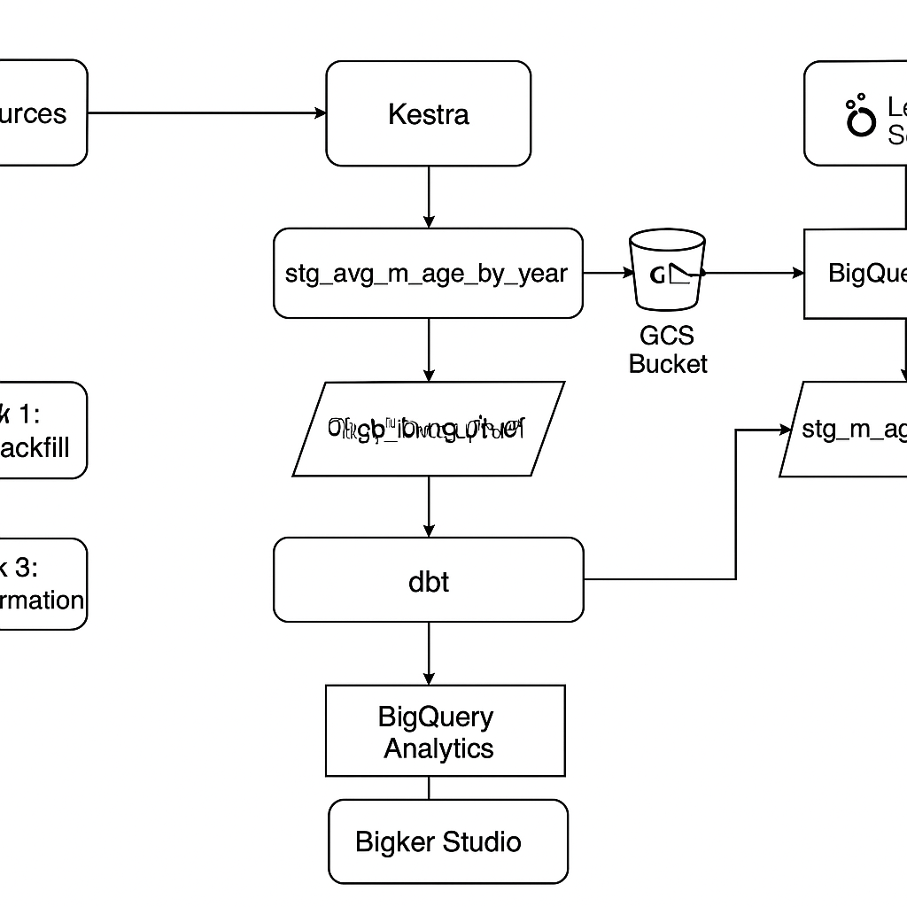
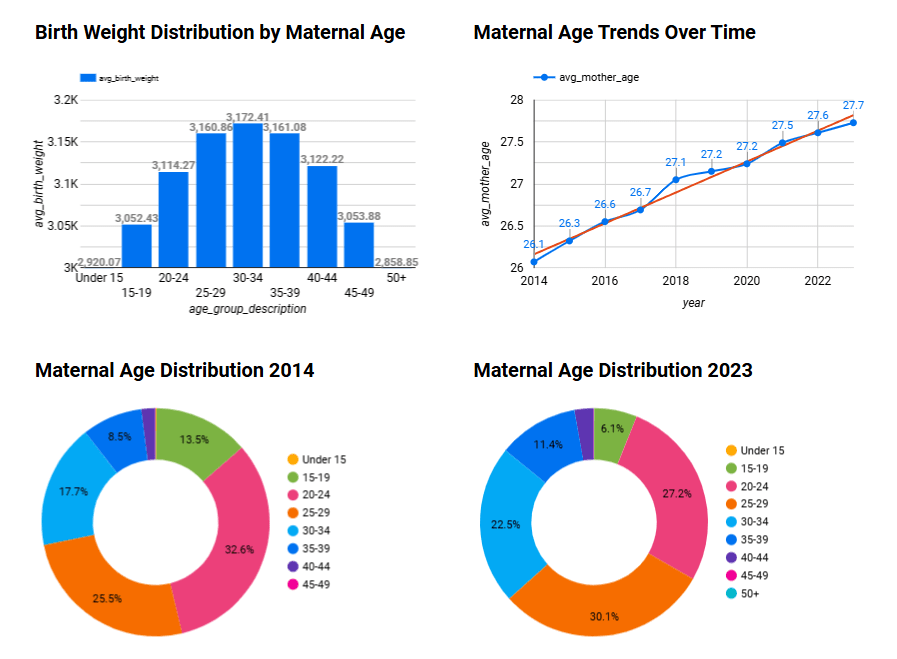

# **Maternal Age and Birth Weight Trends Analysis**  
*A DEZoomcamp Data Engineering Capstone Project*  

## **Overview**  
Maternal age is a known factor in neonatal health outcomes. Birth weight, a key indicator of neonatal health, may vary depending on the maternal age. This project analyzes CDC natality data from 2014 to 2023 to:  
- Track shifts in maternal age distribution.
- Correlate maternal age with birth weight trends.
- Provide scalable data pipelines for public health research.

---

## **Project Architecture**
The project follows a cloud-native ETL pipeline, integrating automated ingestion, processing, and storage for scalable analysis.
  
*Click to view technical documentation*  

---

## **Getting Started**  
For setup and reproducibility instructions, see the [project documentation](docs/README.md).  

---

## **Dashboard**  
  
*Interactive dashboard showing maternal age trends and birth weight distributions.*  

---

## **Why It Matters**  
- **Healthcare**: Identifies high-risk age groups for targeted interventions.  
- **Policy**: Supports evidence-based maternal health programs.  
- **Engineering Impact**: Build a cloud-native, automated data pipeline for efficient public health data processing.

---

## **Future Work**  
- **Expand Dataset**: Incorporate full CDC dataset for deeper analysis.
- **Enhance Automation**: Add service account auto-creation for deployments.
- **Cloud Deployment**: Deploy Kestra on cloud VMs to eliminate local environment dependency.
- **Batch Processing**: Implement Spark for large-scale data processing.
- **Improve DevOps**: Add testing, Makefile support, and a CI/CD pipeline.
---

### **Data Sources**  
- [CDC Natality Data](https://data.nber.org/nvss/natality/)  
