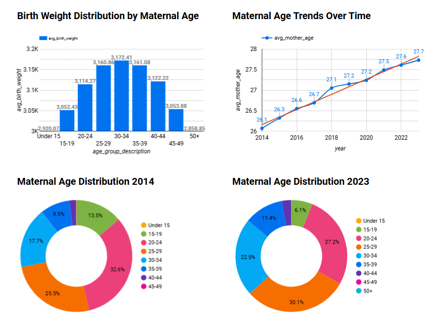

# NATALITY DATA PIPELINE DOCUMENTATION

## REPRODUCTION GUIDE

### PREREQUISITES
- **Docker** with Docker Compose (v27.5.1+)
- **Terraform** (v1.10.5+)
- **Google Cloud Platform** account with:
  - Billing enabled
  - Owner permissions (for initial setup)
### REPOSITORY SETUP
```sh
git clone https://github.com/shawnanx/natality_zoomcamp.git
cd natality_zoomcamp
```
### GCP CONFIGURATION
1. Create a project named `natality-data-project-dez`
2. Create a service account with:
   - BigQuery Admin role
   - Storage Admin role
3. Generate a JSON key and save it as `gcp-key.json` in the project root
   - **Important**: Keep this file safe and never commit it to version control

### IaC SETUP
```sh
cd terraform
# Review and modify variables.tf as needed
terraform init
terraform plan -out=tfplan
terraform apply tfplan
```

### LAUNCH PIPELINE
```sh
cd ../docker
docker-compose up -d
```
Access Kestra UI at: [http://localhost:8080](http://localhost:8080)

### PIPELINE EXECUTION

#### TASK 1: GCP SETUP (`01_gcp_setup`)
1. Edit variables in Kestra UI:
   - **Project ID**: `natality-data-project-dez`
   - **Bucket name**: `[your-bucket-name]`
2. Execute flow to create:
   - GCS bucket
   - BigQuery dataset
 
#### TASK 2: DATA BACKFILL (`02_gcp_bq`)
1. Enable backfill trigger
2. Set date range:
   - **Start**: `2014-01-01 00:00:00`
   - **End**: `2023-01-02 00:00:00`
3. Execute backfill
4. The flow will automatically:
   - Download the raw data in CSV format from an external source
   - Upload the CSV files to the GCS bucket
   - Load the data from GCS into the BigQuery dataset
   - Remove unused columns and clean the data as part of the dataset creation process
   - Merge the cleaned data into a BigQuery table.
   - **Important**: Ensure the data in the date range is complete, as data from years before 2014 might require manual schema adjustments if used
 
#### TASK 3: DBT TRANSFORMATION (`03_dbt_bq`)
1. Execute flow to:
   - Create analytics views
 
---

### LOOKER STUDIO SETUP
1. Connect to BigQuery
2. Select dataset
3. Build dashboards
 

---

## CRITERIA REIVEW

### Problem description
   - *Clearly outlined in the README.md, specifying the problem and project motivation*
### Cloud
   - *Utilizes GCP with Cloud Storage and BigQuery for data storage and analysis*
   - *Infrastructure is managed with Terraform, following IaC principles*
### Data ingestion
   - *Automated end-to-end pipeline using Kestra*
### Stream
   - *Streaming technologies are not implemented*
### Data warehouse
   - *Main table partitioned by birth year for efficient year-to-year comparisons*
   - *Main table Clustered by maternal group for optimized filtering*
### Transformations
   - *Data transformations performed with dbt for maintainability and efficiency*
### Dashboard
   - *Dashboard provided with 4 key tiles as detailed in the README.md*
### Reproducibility
   - *Manually tested with clear instructions for running the pipeline*

 

---

## IMPORTANT NOTES & COMMON ISSUES

### SECURITY
- **Never** commit `gcp-key.json` to version control

### FILE REQUIREMENTS
- JSON key **must** be named exactly `gcp-key.json`
- Must be placed in the project root

### Docker Failures
- Run: `docker system prune -a`
- Rebuild containers
   
### GCP Permission Errors
- Verify that both roles are assigned correctly
- Check that the service account email matches

### Backfill Problems
- Check Kestra executor logs
- Verify date range format
- `Important Note`: Data files from years before 2014 may:
   - Lack certain columns used in this analysis
   - Require manual schema adjustment if included
